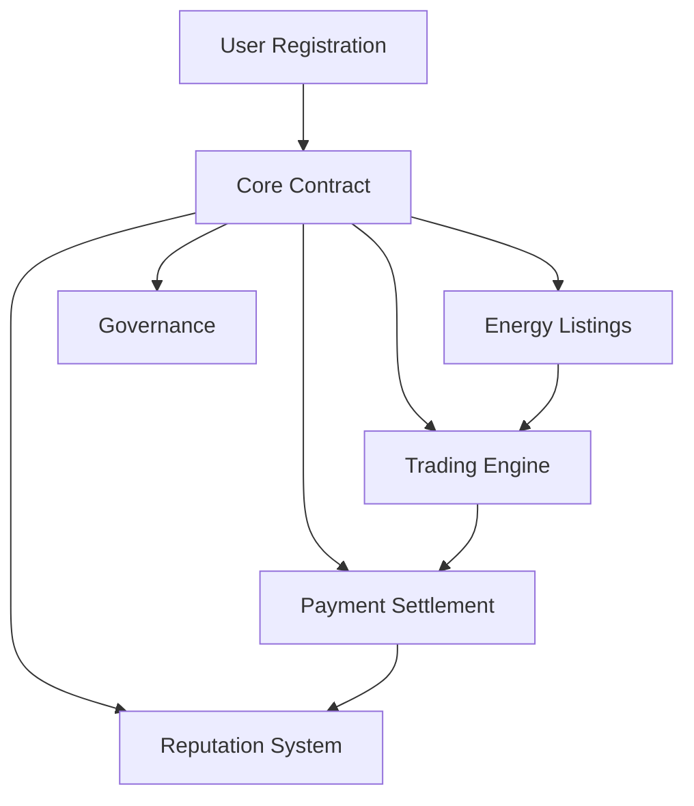

# GridFlow Energy Network

A decentralized energy distribution network enabling peer-to-peer energy trading on the Stacks blockchain.

## Overview

GridFlow is a decentralized platform that facilitates direct energy trading between producers and consumers without traditional intermediaries. The platform enables users to:

- Register as energy producers, consumers, or both
- List excess energy production for sale
- Purchase energy from local producers
- Rate and review trading partners
- Participate in platform governance

By creating a trustless environment for energy trading, GridFlow promotes the development of resilient local energy markets and incentivizes renewable energy production.

## Architecture

The GridFlow platform is built around a core smart contract that manages all essential platform operations.



### Key Components

1. **User Management**
   - Role-based registration system
   - Reputation tracking
   - Energy production/consumption metrics

2. **Energy Trading**
   - Energy listing creation and management
   - Purchase processing
   - Automated payment settlement
   - Delivery verification

3. **Platform Governance**
   - Proposal creation
   - Voting system
   - Automated proposal execution

## Contract Documentation

### Core Contract (gridflow-core.clar)

The main contract handling all platform operations.

#### Key Features

- User registration and role management
- Energy listing creation and management
- Transaction processing and escrow
- Reputation system
- Governance mechanism

#### Access Control

- Public user registration
- Role-restricted energy listing creation
- Owner-only platform configuration
- Transaction-specific user verification

## Getting Started

### Prerequisites

- Clarinet
- Stacks wallet
- STX tokens for transactions

### Installation

1. Clone the repository
2. Install dependencies with Clarinet
3. Deploy contracts to the desired network

### Basic Usage

```clarity
;; Register as a user
(contract-call? .gridflow-core register-user "producer")

;; Create an energy listing
(contract-call? .gridflow-core create-energy-listing 
    u100    ;; amount in kWh
    u1000   ;; price per kWh in microSTX
    "solar" ;; energy type
    "NYC"   ;; location
    u144    ;; expiration in blocks
)

;; Purchase energy
(contract-call? .gridflow-core purchase-energy u1 u50) ;; listing-id, amount
```

## Function Reference

### User Management

```clarity
(register-user (role (string-ascii 10)))
;; Register as producer, consumer, or dual role

(get-user-info (user principal))
;; Retrieve user profile information
```

### Energy Trading

```clarity
(create-energy-listing (energy-amount uint) (price-per-kwh uint) 
    (energy-type (string-ascii 20)) (location (string-ascii 50))
    (expiration-blocks uint))
;; Create new energy listing

(purchase-energy (listing-id uint) (energy-amount uint))
;; Purchase energy from listing

(confirm-energy-delivery (transaction-id uint))
;; Confirm delivery and release payment
```

### Reputation System

```clarity
(rate-user (transaction-id uint) (rating uint) (comment (string-ascii 100)))
;; Rate transaction partner
```

### Governance

```clarity
(create-proposal (description (string-ascii 500)) (changes (string-ascii 500)))
;; Create governance proposal

(vote-on-proposal (proposal-id uint) (vote bool))
;; Vote on proposal
```

## Development

### Testing

Run tests using Clarinet:

```bash
clarinet test
```

### Local Development

1. Start Clarinet console:
```bash
clarinet console
```

2. Deploy contracts:
```bash
clarinet deploy
```

## Security Considerations

### Limitations

- Energy delivery verification relies on off-chain confirmation
- Transaction finality depends on Stacks blockchain confirmation time
- Maximum energy amount per listing is capped at 10,000 kWh

### Best Practices

- Always verify transaction status before confirming delivery
- Use appropriate role permissions for operations
- Monitor expiration times for listings and proposals
- Verify energy amounts and prices before transactions
- Never share private keys or wallet credentials